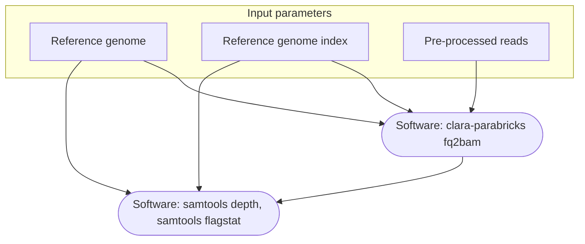

# Sparrow genotyping pipeline

**Authors:** Mark Ravinet and Erik Sandertun Røed

**Maintainer:** Erik Sandertun Røed

## Introduction
Welcome to the guide for the Ecological & Evolutionary Genomics Group sparrow genotyping pipeline. With this pipeline, you will only have to submit a single script to convert raw reads into a filtered `.vcf` file ready for your analyses. More than merely *simplifying* the process, the pipeline *standardises* genotyping within the group so that different projects produce and use compatible datasets. Just as important, the construction of the pipeline emphasises *reproducibility* to promote open science. Readers of our papers should be able to reproduce our results with minimal effort.

### The pipeline 
There are five primary steps in the pipeline, and you can specify whether to run all in one go or do them stepwise. In order, they are ...

1. `preprocess_reads`: Trims and optionally deduplicates and / or downsamples reads.
2. `align_reads`: Aligns the preprocessed reads to a reference genome. Outputs compressed alignment files.
3. `call_variants`: Calls SNP variants across and calculates statistics across the whole genome.
4. `filter_variants`: Applies filters to the SNP variants from the previous step and calculates statistics.
5. `multiqc`: Produces a report with interactive plots showing quality control statistics for outputs produced by the pipeline.

More details on each step are provided below.

## Installation and quick-start
This pipeline is developed primarily for in-house use on the NRIS Saga HPC, but should run on other compute resources and for other projects with minor modifications to its configuration files.

### Prerequesites
The pipeline requires a Linux HPC environment configured with the job management software SLURM, the container software Singularity (or Apptainer) and the environment management software Conda. If you are working on the NRIS Saga HPC, these softwares are pre-installed and the pipeline pre-configured to use them without manual intervention.

### Obtaining the pipeline
The easiest (and the intended) way to obtain and run the pipeline is to clone this GitHub repository to a suitable HPC location (on the NIRS Saga HPC, this is *exclusively* your `$USERWORK` directory, as the pipeline can produce terabytes of working files):
```
git clone https://github.com/EcoEvoGenomics/genotyping_pipeline
```
On occasion we upgrade or modify the pipeline. As a rule this will happen on a separate branch to maintain consistency on the main branch. If you wish to use an in-development version of the pipeline you can obtain a specific branch, e.g. `experimental`:
```
git clone -b experimental https://github.com/EcoEvoGenomics/genotyping_pipeline
```

### Configuring a Nextflow Conda environment
To maximise portability, especially for external users, most of the pipeline dependencies are managed automatically with containers obtained on-demand. But the software Nextflow manages this automation, so Nextflow itself must be manually installed in a Conda environment. Members of the Ecological and Evolutionary Genomics Group can and should use our pre-configured environment, which the pipeline is set to use by default. Other users can replicate our environment with the `nextflow.yml` file:
```
conda create --name nf -f nextflow.yml 
```

### Running the pipeline
In brief the three steps required to run the pipeline once you have cloned the repository are:

1. Download your reads to a location where the pipeline can reach them. If you have e.g. stored your reads on the NRIS NIRD storage infrastructure, you should copy them to your `$USERWORK` on the NRIS Saga HPC.
2. Prepare a comma-separated `.csv` file with sample information. See below.
3. Submit the `genotyping_pipeline.slurm.sh` script, completing and modifying `SETTINGS (1 / 2) User input` as required. Users of other HPC resources than the NRIS Saga HPC will likely have to modify the `SETTINGS (2 / 2) Set up environment` section to ensure Slurm, Singularity, and Conda are set up appropriately. Apart from modifying the SLURM header you should not modify the script outside the `SETTINGS` blocks.

Additional details and examples are provided for each step below. If you are unfamiliar with the pipeline, please do read on!

### The samples csv format

The input `.csv` file should be formatted with one sample per row and the following columns:

1. UiO sample name, e.g. `PDOM2024IND0001M`
2. Forward read location - this should be the **full path** to the forward read
3. Reverse read location - this should be the **full path** to the reverse read

As an example, your file should look like this but **without headers**:

| Sample ID | Path to R1 FASTQ.GZ file | Path to R2 FASTQ.GZ file |
|------------------|-------------------------|-------------------------|
| PDOM2024IND0001M | /path/to/1_R1.fastq.gz | /path/to/1_R2.fastq.gz |
| PDOM2024IND0002F | /path/to/2_R1.fastq.gz | /path/to/2_R2.fastq.gz |
| ... | ... | ... |

**Note:** If an individual is sequenced across multiple lanes, you will have multiple sets of files for the individual. The previous version of the pipeline was built to account for this, **however** this version currently does not accommodate it because of the choice of aligner software. *This will be remedied somehow in a future update*.

## The pipeline in detail
### Step 1: Read pre-processing


### Step 2: Read alignment


## Step 2 - Variant calling

The second script in the pipeline will take a list of bamfiles and performs genotyping on all individuals. To do this, it uses `bcftools` and will call sites at every position in the genome (i.e. it calls invariant sites as well as variants). This is obviously a large job, especially on larger genomes. So to increase efficiency, the script parallelises across genome windows. The default is 10 Mb but you can set these to whatever size you wish. However, tweaking windows has to be done with a separate bash script (see below), not within the nextflow pipeline. After calling genotypes in windows, the script will take care of sorting and concatenating the windows together so that you are left with a vcf file for each chromosome, the mtDNA and also the unanchored scaffolds in your genome.

**NB** as of November 2024, the pipeline has been adapted to use cramfiles instead of bamfiles as these are more efficient in terms of storage space. However, it is still possible to use the `2_call_variants.nf` script with bams if needed. Just point the script to the files and it will work.

### Setting up genome windows

In order to parallelise across genome windows, the script requires a list of said windows in a text file. These are easy to generate using the helper script `0_create_genome_windows.sh`. This simple bash script uses bedtools to split the genome into windows of whatever size you wish (I recommend 10,000,000 bases for most bird genomes) and then it will also create separate files to account for all the scaffolds.

You need to run this script in the directory you are running the nextflow analysis in. You run it like so:

```
bash 0_create_genome_windows.sh ref_index window_size output_name
```

A more specific example, that will work for the house sparrow genome looks like this:

```
bash 0_create_genome_windows.sh /share/Passer/data/reference/house_sparrow_ref.fa.fai 10000000 sparrow_genome_windows.list
```

So option 1 is the path to the reference index, in `fai` format, option 2 is the window size (10 Mb here) and option 3 is the name of the output.

Running this script will produce a set of different files. The first will be text file with a list of all the windows, i.e. `sparrow_genome_windows.list` in the example above. The second will be 10 files called `scaffolds:00`, `scaffolds:01` and so on. The pipeline needs all these files to be present in the base directory you are running nextflow in. 

**NB this script is only really tested on the house sparrow genome** - if it does not work for your genome, you will need to edit it. 

### Creating a list of crams

The other input this script needs is a list of cramfiles. This is very simple - it is just a list of paths of the files that you intend to analyse. If you generated these using `1_trim_map_realign.nf` then the names should already be standardised as `samplename_realigned.cram`. Provided your crams are named this way, then the calling script will also ensure that the sample names are written into the final vcf. Here is an example of what the file should look like:

```
/path/to/align/PDOMNOR8934547_realigned.cram
/path/to/align/PDOMNOR8L19766_realigned.cram
/path/to/align/PDOMNOR8L19786_realigned.cram
/path/to/align/PDOMNOR8L52141_realigned.cram
/path/to/align/PDOMNOR8L52830_realigned.cram
```

Note that these crams do not need top be in the same directory and they do not need to be in a directory called align. This means you can call a vcf from crams in multiple locations easily. 

### Running the script

Once you have your list of crams and genome windows file ready, you can run the script like this:

```
nextflow run 2_call_variants.nf --bams crams.list --windows sparrow_genome_windows.list
```

As above, you can use the `--ref` option to set the location of a specific reference genome. Furthermore, as with all the scripts, you can use the `-resume` option to rerun from a checkpoint if it fails for any reason.

### Optional - specifying ploidy

In some cases, you might need to specify the ploidy of the chromosomes or scaffolds you are calling in your analysis. A typical example of this is when calling SNPs in the mitochondrial genome (i.e. where ploidy is haploid). The pipeline has now been updated to incorporate this functionality but it is **optional**. This means that if you don't specify a ploidy file to `bcftools` then the pipeline will just assume everything is diploid. 

The basic and easiest way to ensure mtDNA is called as haploid is to provide a file that looks like this in the case of the *Passer domesticus* genome:

```
mtDNA 1 16809 F 1
mtDNA 1 16809 M 1

```

This ploidy file is space delimited with the chromosome identity, the start position, the end position, sex, and the ploidy (where 1 = haploid, 2 = diploid). There is more info (here)[https://samtools.github.io/bcftools/bcftools.html#call] on this format. With the example above, the pipeline will assume all other chromosomes are diploid.

You can then run the pipeline exactly as before but this time with the additional `--ploidyFile` option, e.g:

```
nextflow run 2_call_variants.nf --bams bams.list --windows sparrow_genome_windows.list \
--ploidyFile my_ploidy_file.ploidy
```

### Script outputs

The outputs for this script are much simpler than the previous step - it will create a directory called `vcf` and inside will be the gz compressed vcf files for each chromosome, the mtDNA and the genome unanchored scaffolds. These will be raw (i.e. unfiltered) and will contain calls for all variant and non-variant sites in the genome. The directory will also include the indexes for these vcfs.

## Step 3 - filtering

The final script takes control of filtering your vcf files and prepares them for downstream analysis. First it normalises them to remove any issues from concatenating across windows in the calling step. Then it applies custom filters using `vcftools` to create two sets of vcfs; one for population structure analyses (i.e. variants only) and one for genome scan analyses (i.e. variant and invariant sites). There is more information on the outputs below.

### Running the script

The filtering script is the easiest of the three main pipeline scripts to run. It does not require any input as it will automatically look for any vcfs which are gzipped, indexed and which are stored in a directory called `./vcf` in the base directory it is run in. This means it can simply be run with the default filtering options like so:

```
nextflow run 3_filter_variants.nf 
```

However, [as shown here](https://speciationgenomics.github.io/filtering_vcfs/), it is not a good idea to just run filters without checking whether they apply to your dataset. Instead you are able to tweak the filters with a number of options. These are simply provided to the script using option flags and are modified versions of the options for [vcftools](https://vcftools.github.io/examples.html)

- `--miss` - set the missing data at a value between 0 and 1 (where 0 allows 100% missing data and 1 means no missing data); default is 0.8
- `--q_site_ps` - site quality threshold (as a phred score) for the population structure vcfs - default is 30
- `--q_site_gs` - site quality threshold (as a phred score) for the genome scan vcfs - default is 30
- `--min_depth` - minimum mean depth of coverage for a variant across all samples - default is 5
- `--max_depth` - maximum mean depth of coverage for a variant across all samples - default is 30
- `--min_geno_depth` - minimum genotype depth per sample. If lower than this value, the genotype will be converted to a missing site - default is 5
- `--max_geno_depth` - maximum genotype depth per sample. If lower than this value, the genotype will be converted to a missing site - default is 30

You can provide all or some of these options to the script using these options. A fully worked example is below:

```
nextflow run 3_filter_variants.nf --miss 0.5 --q_site_ps 30 --q_site_gs 40 --min_depth 5 --max_depth 15 --min_geno_depth 5 --max_geno_depth 15
```

You do not need to provide all the options - for example, if you want to just alter the missing data threshold, the following will work.

```
nextflow run 3_filter_variants.nf --miss 0.5 
```

You can also now filter for individuals. This is optional, if you run `3_filter_variants.nf` without any options, it will just include all individuals in the vcf. However if you use `--keep`, the pipeline return a vcf with only those individuals listed in the input file. An example of how to run this is like so:

```
nextflow run 3_filter_variants.nf --keep /path/to/my_inds.txt
```

Here the file provided to the `--keep` option is the same as that used by [`vcftools`](https://vcftools.github.io/man_latest.html) - i.e. this should be a list of individuals like so:

```
Ind1
Ind2
Ind3
```

One thing that is very important if you use the `--keep` option. You **must** provide a full path to the file - i.e. `/path/to/my_inds.txt` - otherwise it will not filter for these individuals.

### Script outputs

The script will create a directory called `vcf_filtered`. Inside this vcf will be per chromosome (and scaffold) vcfs with two different suffixes.

- `chrXX_norm_filtered_ps.vcf.gz` - this is the population structure analysis vcf - it contains variant biallelic SNPs only - ready for PCA, ADMIXTURE and so on.
- `chrXX_norm_filtered_gs.vcf.gz` - this is the genome scan vcf - it contains variant and invariant sites - it is ready for both selection and introgression scans

### Creating a variants whole genome vcf

The `3_filter_variants.nf` script will produce outputs per chromosome. This is done for downstream efficiency but it is sometimes useful to have a whole genome vcf for variants - i.e. the `chrXX_norm_filtered_ps.vcf.gz` vcfs. To produce this, you can use the script `4_concat_vcfs.slurm` which will concatenate all the chromosomes together and normalise the output. This is a slurm script that can be submitted but it needs editing first. You should edit the three variables declared at the start of the script:

- `VCF_FILE` - a text file with the paths of the vcfs to concatenate into a single vcf - this MUST be in order
- `OUTPUT_VCF1` - the name of the output vcf prior to normalisation
- `OUTPUT_VCF2` - the name of the output vcf following normalisation

The `VCF_FILE` should look like this:

```
/path/to/my/vcfs/chr1_norm_filtered_ps.vcf.gz
/path/to/my/vcfs/chr2_norm_filtered_ps.vcf.gz
/path/to/my/vcfs/chr3_norm_filtered_ps.vcf.gz
/path/to/my/vcfs/chr4_norm_filtered_ps.vcf.gz
/path/to/my/vcfs/chr5_norm_filtered_ps.vcf.gz
```

The order is important here and should match the order of the chromosomes in the reference genome. 

## Submitting the nextflow pipeline via slurm

The nextflow scripts will take care of the individual scheduling of jobs, but you will need to submit a management job to the cluster using a standard slurm script. This script should be set to run with a relatively low memory (i.e. 4-8Gb), a single CPU and a relatively long time for the entire pipeline to run. For example, you could run it for a week. 

The actual control for each of the different jobs that the nextflow pipeline submits, you should look at the `nextflow.config` file. This is already to set up to use slurm. However, slurm job schedulers will differ between institutions. For the Nottingham Augusta HPC, the `nextflow.config` file will work straight out of the box as it inherits the queue and settings you submit in the master script. For SAGA, you need to edit the `nextflow.config` file to get it to work. You will need to add the `account` value for all of the processes like so, where `XXX` is the account you use on the cluster.

```
   withName: trimming{
   clusterOptions = " --account=XXX --job-name=trim --time=12:00:00 --mem-per-cpu=20G --cpus-per-task=1"
   }
```

**NB if you want to test the pipeline locally** you need to change the name of the `nextflow.config` file so that it is not read by the pipeline automatically. For example, just do this:

```
mv nextflow.config nextflow_config
```

Just remember that when you do go back to submitting the nextflow script, you must change this back so that the pipeline will resume the slurm execution. 

**NB** For group members and users on Saga, you can use the `run_genotype_pipeline_saga.slurm` as a guideline. I have included it on this repo as a template for others too. 

## Generating a quality control report

One aspect of the pipeline is that it is designed to produce outputs that can be easily summarised in a simple quality control report. For this, I recommend using `multiqc`. Once the pipeline is finished (or at any of the intermediate main three steps). 

All you need to do is be in the directory you have run the genotyping pipeline in and then run the following:

```
multiqc .
```
-----------------
*This pipeline was initiated from a copy of https://github.com/markravinet/genotyping_pipeline_v2.git on Wednesday 11 Dec 2024.*