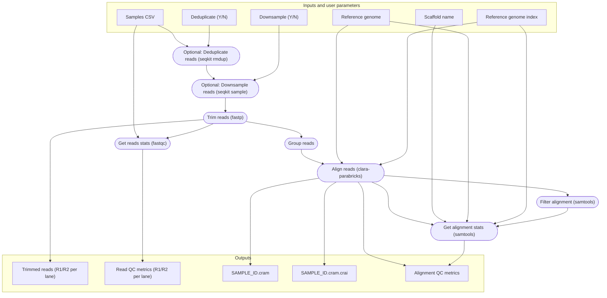
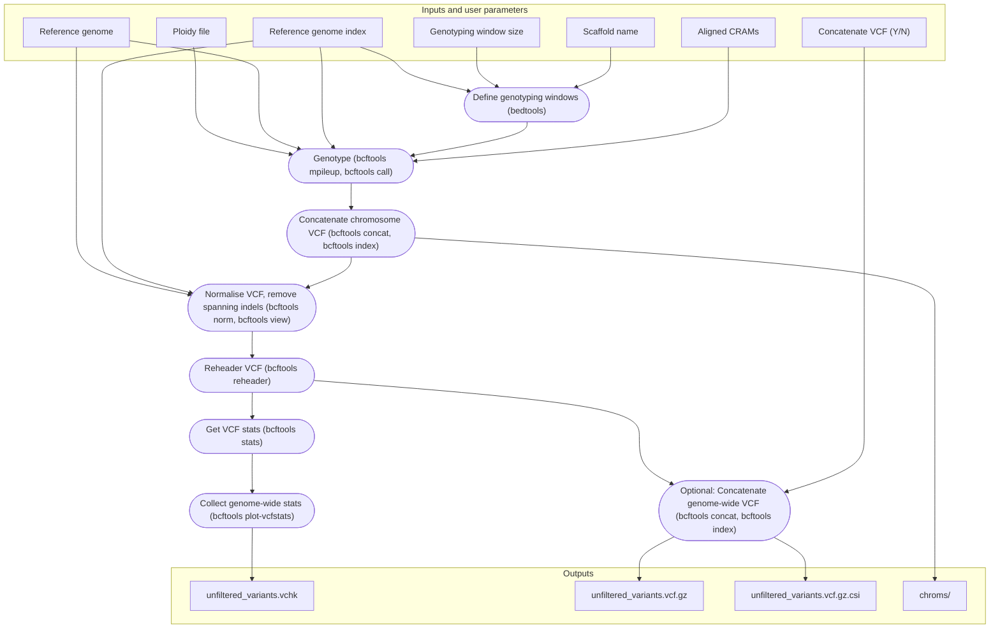
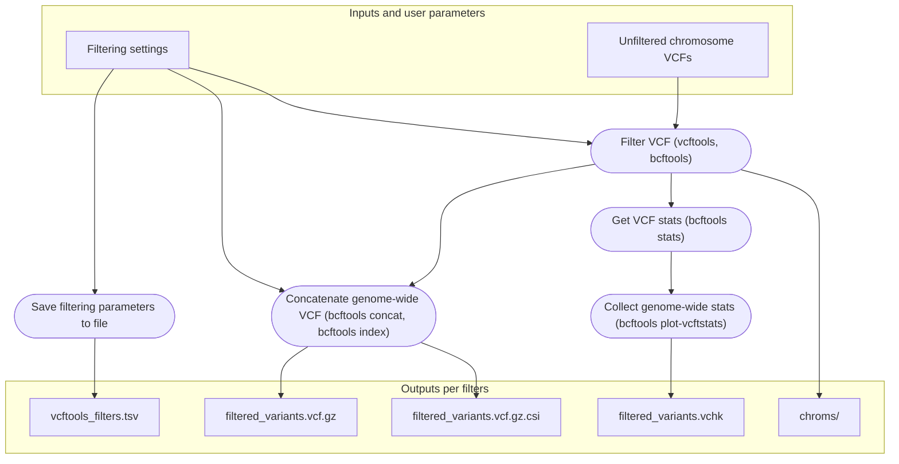
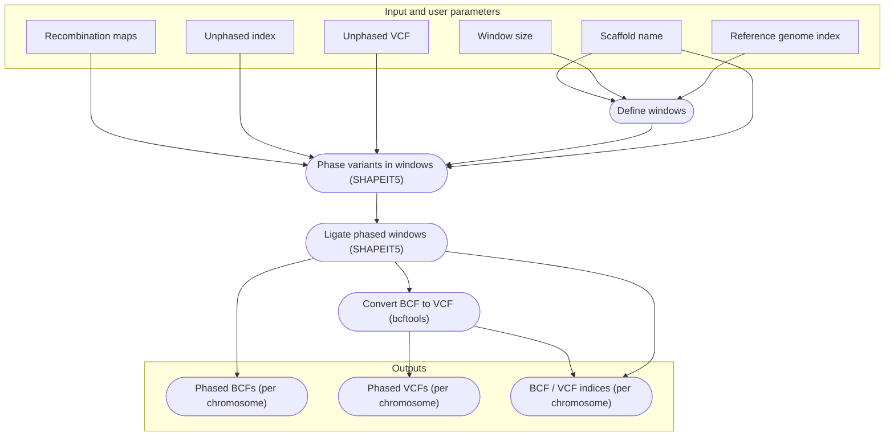

# Sparrow genotyping pipeline

**Authors:** Mark Ravinet and Erik Sandertun Røed

**Maintainer:** Erik Sandertun Røed

## Introduction
Welcome to the guide for the Ecological & Evolutionary Genomics Group sparrow genotyping pipeline. The design philosophy behind this utility is that you will only have to submit a single script to convert raw reads into a filtered `vcf` file ready for your analyses. More than merely *simplifying* the process, the pipeline *standardises* genotyping within the group so that different projects produce and use compatible datasets. Just as important, the construction of the pipeline emphasises *reproducibility* to promote open science. Readers of our papers (and perhaps also authors) should be able to reproduce our results with minimal effort.

There are four primary steps in the pipeline, and you can specify whether to run all in one go or perform them in a stepwise order. Each of these is a different Nextflow script but they are all controlled by a master slurm script - `genotyping_pipeline.slurm.sh`. So you only ever have to interact with this slurm script - not the nextflow scripts directly. For those who used previous iterations of this pipeline, we hope this greatly simplifies things. 

The primary steps are: 

1. `trim_align_reads`: Trims and optionally deduplicates and / or downsamples reads before aligning to a reference genome.
2. `call_variants`: Calls SNP variants across and calculates statistics across the whole genome.
3. `filter_variants`: Applies filters to the SNP variants from the previous step and calculates statistics.
4. `phase_variants`: You may finally phase the filtered variants.

More details on each step and how to run them are provided below. Additionally, the pipeline will always produce a MultiQC report showing quality control statistics.

## Quick-start and installation
This pipeline is developed primarily for in-house use on the NRIS Saga HPC, but should run on other compute resources and for other projects with minor modifications to its configuration files. Note that at present, we can only maintain support for the Saga version of the pipeline - i.e. that used by the group. If you want to use it elsewhere, you are welcome to but we are limited in how much we can help set this up. 

### Prerequisites
The Nextflow pipeline is configured to run on a Linux HPC environment with the job management software Slurm, the container software Singularity (or Apptainer). If you are working on the NRIS Saga HPC, Slurm and Apptainer are pre-installed and the pipeline pre-configured to use them without manual intervention. If you are an advanced Nextflow user, you may re-configure the pipeline to use other resources.

### Installing Nextflow with Conda
To maximise portability, especially for external users, most of the pipeline dependencies are managed automatically with containers obtained on-demand. But the software Nextflow manages this automation, so Nextflow itself must be manually installed - for instance in a Conda environment. External users are welcome to replicate the Conda environment we use for Nextflow with the included YAML file:
```
conda create --name nf -f nextflow-25.04.6.conda.yaml 
```
**NB:** If you are working on Saga as part of the group **YOU DO NOT NEED TO RUN THIS STEP**. Members of the Ecological and Evolutionary Genomics Group *can* and *should* use our pre-configured environment, which the pipeline is set to use by default. 

### Obtaining the pipeline
The easiest (and the intended) way to obtain and run the pipeline is to clone this GitHub repository to a suitable HPC location (on the NIRS Saga HPC, this is *exclusively* your `$USERWORK` directory, as the pipeline can produce terabytes of working files):
```
git clone https://github.com/EcoEvoGenomics/genotyping_pipeline
```
On occasion we upgrade or modify the pipeline. As a rule this will happen on a separate branch to maintain consistency on the main branch. If you wish to use an in-development version of the pipeline you can obtain a specific branch, e.g. `experimental`:
```
git clone -b experimental https://github.com/EcoEvoGenomics/genotyping_pipeline
```
This is all you need to do to install the software for use!

### Running the pipeline
In brief the three steps required to run the pipeline once you have cloned the repository are:

1. Download your reads to a location where the pipeline can reach them. If you have e.g. stored your reads on the NRIS NIRD storage infrastructure, you should copy them to your `$USERWORK` on the NRIS Saga HPC.
2. Prepare a comma-separated `.csv` file with sample information. See below.
3. Submit the `genotyping_pipeline.slurm.sh` script, completing and modifying `SETTINGS (1 / 2) User input` as required. 

NB: For step 3, users of  HPC resources other than the NRIS Saga HPC will likely have to modify the `SETTINGS (2 / 2) Set up environment` section to ensure Slurm, Singularity, and Conda are set up appropriately. Apart from modifying the SLURM header you should not modify the script outside the `SETTINGS` blocks.

Additional details and examples are provided for each step below. If you are unfamiliar with the pipeline, please do read on!

### The samples csv format

The input `.csv` file should be formatted with one sample per row and the following **four** columns:

1. Sample name, e.g. `PDOM2024IND0001M` for a sparrow from our groups collection
2. Sequencing lane for the sequence files in the format "LXXX" where "XXX" is a number with leading zeroes (e.g. L001). If you have only one set of files per sample, just use "L001".
3. Forward read location - this should be the **full path** to the forward read
4. Reverse read location - this should be the **full path** to the reverse read

As an example, your file should look like this but **without headers**:

| Sample ID | Lane | Path to R1 FASTQ.GZ file | Path to R2 FASTQ.GZ file |
|------------------|------|-------------------------|-------------------------|
| PDOM2024IND0001M | L001 | /path/to/1M_L001_R1.fastq.gz | /path/to/1M_L001_R2.fastq.gz |
| PDOM2024IND0001M | L002 | /path/to/1M_L002_R1.fastq.gz | /path/to/1M_L002_R2.fastq.gz |
| PDOM2024IND0002F | L001 | /path/to/2F_R1.fastq.gz | /path/to/2F_R2.fastq.gz |
| ... | ... | ... | ... |

A note on the lane codes (L001, L002, ...) - these are necessary to allow the pipeline to merge sequencing files from the same individual sequenced on different lanes. You should check the sample catalogue and assess the number of lanes you require for each sample. In *principle* (but **_read on_**), the codes are arbitrary and *could* be L001, L002, ... or L1, L2, ... or similar. **But the QC report will only be organised properly if you use the format L001, L002, and so on**. We note here that other formats are permissible, in case you happen to use another (e.g. by accident); the most important thing is that read files from different lanes are explicitly stated as such, otherwise the pipeline will fail to group reads from the same individual. If in doubt about this, just ask!

## The pipeline
### Step 1: Read trimming and alignment

This first script will take your raw reads and run them through `fastqc` for a quality assessment. It will then trim them for low-quality bases and remove any adapter sequences with `fastp`. If you choose the deduplication step, then this will be done using `seqkit`. Similarly if the downsampling option is turned on, then `seqkit` will perform this too. Once trimming, and optionally deduplication and downsampling is complete, the `fastqc` quality assessment will be repeated. Then, the pipeline will group reads (i.e. from across lanes) belonging to the same individuals and map them to a reference genome of your choice (default is the 2014 House sparrow reference). This step is now performed using an implementation of `bwa mem` within [NVIDIA Clara Parabricks](https://docs.nvidia.com/clara/parabricks/latest/index.html) - a GPU accelerated genomics suite. This enables extremely fast and efficient alignment.  Once aligned, the pipeline will produce statistics on the mapping efficiency and depth of coverage of each mapped individual before filtering out PCR and optical duplicates (by default) and then repeating the quality assessment.



This part of the pipeline produces the following outputs:

- trimmed reads (per lane, not per sample)
- Read QC metrics (per lane, not per sample)
- Aligned cram file (`SAMPLE_ID.cram`)
- Aligned cram file index (`SAMPLE_ID.cram.cai`)
- Alignment QC statistics

### Step 2: Variant calling

The second script in the pipeline will take aligned crams performs variant calling (genotyping) on all individuals against the specified reference genome. To do this, it uses `bcftools` and will call sites at every position in the genome (i.e. it calls invariant sites as well as variants). This is obviously a large job, especially on larger genomes. So to increase efficiency, the script parallelises across genome windows. The default is 10 Mb but you can set these to whatever size you wish in the slurm script. Previously you had to set windows outside of the pipeline but this step now does this for you automatically. It also takes into account ploidy of the mitochondrial genome. After calling genotypes in windows, the script will take care of sorting and concatenating the windows together so that you are left with a vcf file for each chromosome, the mtDNA and also the unanchored scaffolds in your genome. These are unfiltered and ready for the next step. It also generates some statistics for downstream checking. 




This part of the pipeline produces the following outputs:

- Statistics on unfiltered variants
- Per-chromosome unfiltered variant VCF plus unfiltered variant VCF for scaffolds
- Concatenated unfiltered variant VCF (optional)
- CSI index for any vcf produced. 

### Step 3: Variant filtering

The third script takes control of filtering your vcf files and prepares them for downstream analysis. You need to provide it with the settings you require for filtering (via the main slurm script) and it will use unfiltered chromosome level vcfs to perform filtering. Filters are applied in windows and windows are concatenated and then normalise to remove any errors. The script will produce both per chromosome vcfs and a whole-genome vcf for additional analysis if required. The script also produces statistics on the filtered variants which can be incorporated in the multiQC reports in the next and final step. 

It is worth noting that filtering is not a black-box/set-and-forget/run-once process! The filters you apply matter, and not only should you think carefully about them, you may very well need to produce datasets with different filters for different downstream analyses (see https://doi.org/10.1038/s41576-024-00738-6). For that reason, the pipeline has been built to make it easy to return to this step after you've produced the MultiQC report and inspected the quality statistics (below). To take an example, you may first run the pipeline through all steps, i.e. `yes` for all `trim_align_reads`, `call_variants`, `filter_variants` (and `phase_variants`) with default filters. Then you can switch off `trim_align_reads` and `call_variants` but re-run `filter_variants` (and, again, `phase_variants`) with different filtering settings (recall that all the settings you can change are exposed in the main SLURM script and you should not change anything elsewher) in the same directory to produce a re-filtered dataset (**without changing anything else**). To do so, simply change the `filtering_label` variable (to give a new name to your refiltered data) and the relevant filtering settings. Your newly re-filtered dataset will be found in a correspondingly labelled directory under the filtered genotypes directory and the MultiQC report will be updated to show (all) the re-filtered dataset alongside the unfiltered data. You can do this as many times as you need until you are content your filters are appropriate!



This part of the pipeline produces the following outputs:

- Statistics on filtered variants
- Per-chromosome filtered variant VCF plus one for scaffolds
- Concatenated filtered variant vcf (optional)
- CSI index for any vcf produced
- a tsv file summarising the filters applied 

### Step 4: Variant phasing

This final step allows you to phase the variants after filtering them, and will produce its output alongside your filtering output so that phased variants are always kept with the exact VCFs they were produced from.



This part of the pipeline produces the following outputs:

- Per-chromosome phased BCF
- Per-chromosome phased VCF
- CSI index for each BCF and VCF produced

## The quality control report

The pipeline always produces a quality control report, whether you run a single step of the pipeline or when it is run in entirety. The report gives you insight into the quality of reads, samples, mapping performance and variant calling. It uses [multiqc](https://docs.seqera.io/multiqc) which is very comprehensive and provides a useful overview. This takes time to learn how to read but is well worth paying extra attention to in order to ensure your analyis has worked!

_A walkthrough of the MultiQC report will follow here later ..._

-----------------
*This pipeline was initiated from a copy of https://github.com/markravinet/genotyping_pipeline_v2.git on Wednesday 11 Dec 2024.*
