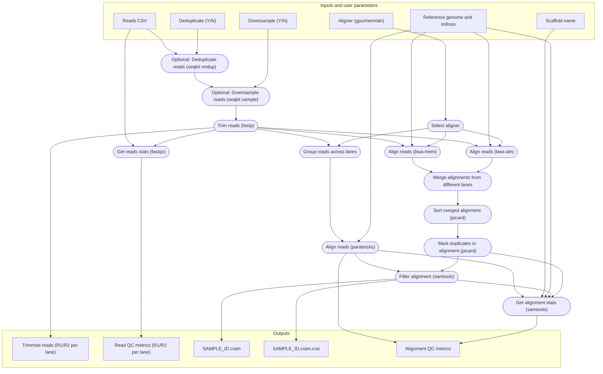
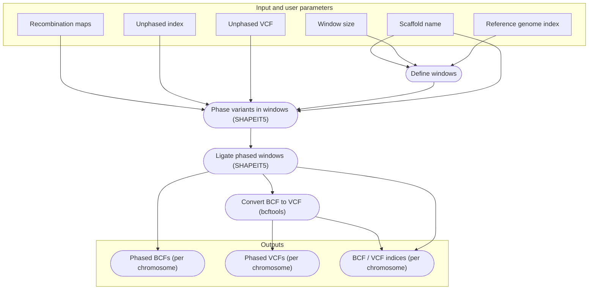

# XENO: Expedient Genotyping for Non-Model Organims

## What is XENO?
XENO is a beginner-friendly genotyping pipeline built for evolutionary and ecological genomics. With the submission of one script, any biologist of minimal bioinformatic experience can use XENO to (1) trim and align reads to a reference genome, (2) call variants, (3) filter those variants, and finally (4) phase the variants. These four stages of XENO may be performed separately in stepwise order or end-to-end. At each stage, XENO outputs alignments, variant call files, and / or quality control statistics. These outputs may be passed directly to RIPLEY (link) to conduct many of the most common analyses in evolutionary and ecological genomics with similar ease.

The Wiki describes XENO in greater detail. There you will also find guides for some specific use-cases or users.

## Installation
### Prerequisites
XENO is built for HPC environments configured with the job manager Slurm and the container manager Apptainer. Note that on some HPCs, Apptainer (or its sibling Singularity) is enabled by default - on others you must manually load it. While advanced users will be able to re-configure XENO for HPC environments without Slurm and / or Apptainer, we are regrettably not able to provide much support for such use cases. In any case, the primary workhorse and only absolute dependency of XENO is Nextflow version 25.04.6. Please be mindful that the specific version is not a suggestion, it is a requirement. With Slurm, Apptainer, and Nextflow configured, XENO automatically obtains remaining software dependencies on-demand. One notable exception is that you will need the software bwa (link) to index your reference genome if it is not already indexed (see [here](#required-reference-files)).

### Installing Nextflow with Conda
If you must install Nextflow version 25.04.6, you can e.g. do so with Conda: the environment we used to develop XENO is listed in the included YAML file.
```
conda create --name nf -f examples/nextflow-25.04.6.conda.yaml 
```

### Installing XENO
The intended way to "install" XENO is simply to clone this GitHub repository to a suitable location on your HPC environment:
```
git clone https://github.com/EcoEvoGenomics/genotyping_pipeline
```
Be mindful that XENO can and often will produce terabytes of working files. It is therefore ill-advised to install XENO to a location with limited storage space and especially to locations where you share limited storage space with others (unless you are certain what you are doing).

### Installing a development version of XENO
While XENO is not in active development for new features, we do strive to maintain it. For instance we try to respond to bug reports and improve robustness to different inputs as more users bring their unique data to XENO. As such, there will on occasion be branches that are more recent than `main`. If you wish to use an in-development version you can obtain a specific branch, e.g. `dev`:
```
git clone -b dev https://github.com/EcoEvoGenomics/genotyping_pipeline
```

## Quickstart
### Summary
Once installed, the steps to use XENO are:

1. Ensure XENO has read-access to your sequence files in fastq.gz format. You may e.g. have to download them if they are stored externally.
2. Ensure XENO has read-access to your reference genome files and that the reference files are correctly formatted (see [here](#required-reference-files)).
3. Prepare an input file with sample information in comma-separated format (see [here](#how-to-correctly-format-your-input-csv-file)).
4. Adjust settings as necessary (see [here](#how-to-launch-xeno)) and finally launch XENO through the Slurm job scheduler (see [here](#launching-xeno-through-slurm)) or on a screen (see [here](#launching-xeno-on-a-screen-terminal)).

If for any reason XENO encounters an error, it will stop. Most often this happens early because of a faulty read file for a sample. If this befalls you, you may simply remove the offending sample from the input file and relaunch XENO. Thanks to the Nextflow cache (in the directory called `/work`), XENO will by default recognise processes it has completed before. If XENO stops for another reason than a bad sample, feel free to post an issue describing the error (link).

### Required reference files
When you configure the XENO script (more on this [later](#how-to-launch-xeno)), you will encounter the following section of unset variables:
```
# PROVIDE DETAILS OF REFERENCE GENOME
ref_genome=
ref_recombination_map_dir=
ref_scaffold_name=
ref_ploidy_file=./examples/default.ploidy
```
You must prepare your reference files to set each of these variables, but not all are necessary. In order, they are:

- `ref_genome`: The absolute path to your reference genome in uncompressed fasta format (.fa, .fasta). The reference genome must have been indexed with `bwa index`. The index output files must be found at the same path (they have the following additional extensions: `.amb`, `.ann`, `.bwt`, `.fai`, `.pac`, and `.sa`).
- `ref_recombination_map_dir`: **Optional.** The absolute path to a directory containing recombination rate maps for variant phasing. The recombination maps must be compatible with SHAPEIT5 (link). Within the directory should be one recombination map file for each contig in the reference genome and they must be named on the format "contig.map". If for instance your reference genome has the contigs "chr1" and "chr2", the recombination map directory must contain two files: "chr1.map" and "chr2.map". If you do not have recombination maps, you may set this variable to an arbitrary path: then XENO will statistically phase the variants instead of using maps.
- `ref_scaffold_name`: A text string. Many reference genomes distinguish contigs (e.g. chr1, chr2, ...) from loosely assembled scaffolds with prefixes or naming conventions. If your reference genome index does, provide a prefix characteristic of scaffolds here. For instance, NCBI reference genomes may prefix contigs with "NC_" while scaffolds are prefixed "NW_". Then, you should set this variable to `"NW_"`. This is to more efficiently distribute genotyping windows. If the reference genome you use makes no distinction between contigs and scaffolds, set this variable to an arbitrary string that matches no contig.
- `ref_ploidy_file`: See the ploidy files in the examples directory. This file is required to call sex chromosomes, haploid chromosomes, mtDNA, or other non-diploid chromosomes correctly. By default everything is considered diploid (`examples/default.ploidy`). See `examples/passer.ploidy` for a sample ploidy file encoding female heterogamy and mitochondrial haploidy.

**NB:** Contigs and scaffolds in the reference genome *must* be named with alphanumerical characters and underscores only. XENO *will* stop if the reference genome does not satisfy this requirement. Many users will find their reference genome does not: for instance, NCBI reference genomes usually contain punctuation. If this applies to you, you can simply rename the contigs in the reference index and in supporting metadata such as GFF files. We regret the inconvenience of this and may update XENO in the future to accomodate more contig names.

### How to correctly format your input CSV file

For each sample you wish to genotype, XENO requires five inputs. You must provide the inputs in a comma-separated file with one row per sample and five columns:

1. Sample ID. A single text string of *only* alphanumeric characters, e.g. "SAMPLE1" but not "SAMPLE_1" or "SAMPLE.1".
2. Sample sex. The sex codes (e.g. F, M) are arbitrary but *must* correspond to the ploidy file provided to the `ref_ploidy_file` variable (see [above](#required-reference-files)).
3. Lane code to distinguish reads from the same sample but different lanes. Use the format "LXXX" where "XXX" is a number with leading zeroes (e.g. L001). If you have only one set of files per sample, use "L001".
4. Forward read location. Absolute path to the forward read file.
5. Reverse read location. Absolute path to the reverse read file.

These inputs must be in the above order from left to right. For example (but **do not include headers**):

| Sample ID | Sex | Lane | Path to R1 FASTQ.GZ file | Path to R2 FASTQ.GZ file |
|------------------|---|------|-------------------------|-------------------------|
| PDOM2024IND0001M | M | L001 | /path/to/1M_L001_R1.fastq.gz | /path/to/1M_L001_R2.fastq.gz |
| PDOM2024IND0001M | M | L002 | /path/to/1M_L002_R1.fastq.gz | /path/to/1M_L002_R2.fastq.gz |
| PDOM2024IND0002F | F | L001 | /path/to/2F_R1.fastq.gz | /path/to/2F_R2.fastq.gz |

Ensure that the file corresponds to regular CSV conventions: separate values only by commas, add no trailing or leading spaces, and include a newline at the end. A final note on the lane codes: in *principle* the format is arbitrary and XENO will accept L1, L2, etc. as well as L001, L002, etc. The most critical is that lanes are distinguished by different codes and that each lane has a separate row. **However, the QC report will only be organised properly if you use the format LXXX (L001, L002, ...).**

### How to launch XENO
**NB:** For step 3, users of  HPC resources other than the NRIS Saga HPC will likely have to modify the `SETTINGS (2 / 2) Set up environment` section to ensure Slurm, Singularity, and Conda are set up appropriately. Apart from modifying the SLURM header you should not modify the script outside the `SETTINGS` blocks.
#### Launching XENO through Slurm
#### Launching XENO on a screen terminal 18:45 - 23:45 (5hrs)

## The pipeline
### Step 1: Read trimming and alignment

This first workflow will take your raw reads and run them through `fastqc` for a quality assessment. It will then trim them for low-quality bases and remove any adapter sequences with `fastp`. If you enable the deduplication step, then this will be done using `seqkit`. Similarly if the downsampling option is enabled, then `seqkit` will perform this too. Once trimming, and optionally deduplication and downsampling is complete, the `fastqc` quality assessment will be repeated. Then, the pipeline will group reads (i.e. from across lanes) belonging to the same individuals and map them to a reference genome of your choice. This step is now performed by default with the `bwa mem` implemantation of [NVIDIA Clara Parabricks](https://docs.nvidia.com/clara/parabricks/latest/index.html) - a GPU accelerated genomics suite. This makes for extremely fast alignment (provided you have ample access to suitable GPUs). Alternatively, you may opt to align using the original CPU-based implementation of `bwa mem` or its predecessor `bwa aln`. While `bwa aln` could be more suitable for very short reads, be mindful that its output is not directly comparable to that of Parabricks' `bwa mem` implementation. Once aligned, the pipeline will produce statistics on the mapping efficiency and depth of coverage of each mapped individual before filtering out PCR and optical duplicates (by default) and then repeating the quality assessment.


```mermaid
flowchart TB
   subgraph "Inputs and user parameters"
   v0["Reads CSV"]
   v7["Downsample (Y/N)"]
   v4["Deduplicate (Y/N)"]
   v14["Reference genome and indices"]
   v18["Scaffold name"]
   v51["Aligner (gpu/mem/aln)"]
   end
   v2(["Get reads stats (fastqc)"])
   v5(["Optional: Deduplicate reads (seqkit rmdup)"])
   v8(["Optional: Downsample reads (seqkit sample)"])
   v10(["Trim reads (fastp)"])
   v12(["Group reads across lanes"])
   v50(["Select aligner"])
   v16(["Align reads (parabricks)"])
   v48(["Align reads (bwa-mem)"])
   v40(["Align reads (bwa-aln)"])
   v43(["Merge alignments from different lanes"])
   v45(["Sort merged alignment (picard)"])
   v47(["Mark duplicates in alignment (picard)"])
   v19(["Get alignment stats (samtools)"])
   v25(["Filter alignment (samtools)"])
   v0 --> v2
   v0 --> v5
   v5 --> v8
   v8 --> v10
   v10 --> v2
   v10 --> v12
   v10 --> v40
   v10 --> v48
   v12 --> v16
   v14 --> v16
   v14 --> v40
   v14 --> v48
   v16 --> v19
   v16 --> v25
   v18 --> v19
   v14 --> v19
   v25 --> v19
   v4 --> v5
   v7 --> v8
   v10 --> v20
   v2 --> v21
   v25 --> v22
   v25 --> v23
   v16 --> v24
   v19 --> v24
   v51 --> v50
   v50 --> v12
   v50 --> v48
   v50 --> v40
   v48 --> v43
   v40 --> v43
   v43 --> v45
   v45 --> v47
   v47 --> v19
   v47 --> v25
   subgraph "Outputs"
   v20["Trimmed reads (R1/R2 per lane)"]
   v21["Read QC metrics (R1/R2 per lane)"]
   v22["SAMPLE_ID.cram"]
   v23["SAMPLE_ID.cram.crai"]
   v24["Alignment QC metrics"]
   end
```

This part of the pipeline produces the following outputs:

- trimmed reads (per lane, not per sample)
- Read QC metrics (per lane, not per sample)
- Aligned cram file (`SAMPLE_ID.cram`)
- Aligned cram file index (`SAMPLE_ID.cram.cai`)
- Alignment QC statistics

### Step 2: Variant calling

The second workflow in the pipeline will take aligned crams and perform variant calling (genotyping) on all individuals against the specified reference genome. To do this, it uses `bcftools` to call sites at every position in the genome (i.e. it calls invariant sites as well as variants). This is obviously a large job, especially on larger genomes. So to increase efficiency, the script parallelises across genome windows. These windows are defined internally based on the number of input samples, to parallelise the genotyping most cost-efficiently. The pipeline also takes into account ploidy of the sex chromosomes and the mitochondrial genome (**Note:** this is, in fact, currently broken and you should use output for *autosomes only* - but a fix is planned). After calling genotypes in windows, the script will take care of sorting and concatenating the windows together so that you are left with a vcf file for each chromosome, the mtDNA and also the unanchored scaffolds in your genome. These are unfiltered and ready for the next step. It also generates some statistics for downstream checking.

Optionally, you can enable concatenation of the chromosomal VCFs into one whole-genome VCF. If so, the pipeline will automatically consult the reference genome index in order to concatenate the chromosomes in the correct order. All (non-chromosome) scaffolds are always placed at the end. **Note:** Other than for QC, you are unlikely to need an unfiltered whole-genome VCF, and it will potentially be very, *very* large. The same concatenation process is always run in the next step of the pipeline (variant filtering) so you will get a whole-genome concatenated *filtered* VCF.


```mermaid
flowchart TB
   subgraph "Inputs and user parameters"
   v6["Genotyping window size"]
   v22["Concatenate VCF (Y/N)"]
   v2["Reference genome"]
   v11["Aligned CRAMs"]
   v4["Reference genome index"]
   v7["Scaffold name"]
   v0["Ploidy file"]
   end
   v8(["Define genotyping windows (bedtools)"])
   v13(["Genotype (bcftools mpileup, bcftools call)"])
   v14(["Concatenate chromosome VCF (bcftools concat, bcftools index)"])
   v16(["Normalise VCF, remove spanning indels (bcftools norm, bcftools view)"])
   v17(["Reheader VCF (bcftools reheader)"])
   v18(["Sort VCF samples (bcftools query, bcftools view)"])
   v19(["Get VCF stats (bcftools stats)"])
   v21(["Collect genome-wide stats (bcftools plot-vcfstats)"])
   v23(["Optional: Concatenate genome-wide VCF (bcftools concat, bcftools index)"])
   v4 --> v8
   v4 --> v23
   v6 --> v8
   v7 --> v8
   v7 --> v23
   v0 --> v13
   v2 --> v13
   v4 --> v13
   v8 --> v13
   v11 --> v13
   v13 --> v14
   v2 --> v16
   v4 --> v16
   v14 --> v16
   v16 --> v17
   v17 --> v18
   v18 --> v19
   v19 --> v21
   v18 --> v23
   v22 --> v23
   v21 --> v26
   v23 --> v24
   v23 --> v25
   v18 --> v27
   subgraph "Outputs"
   v24["unfiltered_variants.vcf.gz"]
   v25["unfiltered_variants.vcf.gz.csi"]
   v26["unfiltered_variants.vchk"]
   v27["chroms/"]
   end
```

This part of the pipeline produces the following outputs:

- Statistics on unfiltered variants
- Per-chromosome unfiltered variant VCF plus unfiltered variant VCF for scaffolds
- Concatenated unfiltered variant VCF (optional)
- CSI index for any vcf produced. 

### Step 3: Variant filtering

The third workflow filters your VCF files to prepare them for downstream analysis. You need to provide the filtering flags you require in a text file via the main slurm script. See `examples/default_filters.txt` for formatting - the required format is a file with `vcftools` flags, so you have complete freedom to specify any combination of filtering flags accepted by `vcftools` (see the `vcftools` [documentation](https://vcftools.github.io/man_latest.html#SITE%20FILTERING%20OPTIONS)). The filters you specify will be applied to the unfiltered chromosome level VCFs. The filtered per-chromosome VCFs are then concatenated and normalised to yield filtered VCFs both per-chromosome and whole-genome. The pipeline automatically concatenates the per chromosome VCFs in the order specificed by the reference genome index and places all scaffolds at the end. The workflow finally outputs statistics on the filtered variants which can be incorporated in the multiQC reports in the next and final step. 

It is worth noting that filtering is not a black-box/set-and-forget/run-once process! The filters you apply matter, and not only should you think carefully about them, you may very well need to produce datasets with different filters for different downstream analyses (see https://doi.org/10.1038/s41576-024-00738-6). For that reason, the pipeline has been built to make it easy to return to this step after you've produced the MultiQC report and inspected the quality statistics (below). To take an example, you may first run the pipeline through all steps, i.e. `yes` for all `trim_align_reads`, `call_variants`, `filter_variants` (and `phase_variants`) with default filters. Then you can switch off `trim_align_reads` and `call_variants` but re-run `filter_variants` (and, again, `phase_variants`) with different filtering settings (recall that all the settings you can change are exposed in the main SLURM script and you should not change anything elsewhere) in the same directory to produce a re-filtered dataset (**without changing anything else**). To do so, simply change the `filtering_label` variable (to give a new name to your refiltered data) and the relevant filtering settings. Your newly re-filtered dataset will be found in a correspondingly labelled directory under the filtered genotypes directory and the MultiQC report will be updated to show (all) the re-filtered dataset alongside the unfiltered data. You can do this as many times as you need until you are content your filters are appropriate!


```mermaid
flowchart TB
   subgraph "Inputs and user parameters"
   v5["Filtering settings"]
   v0["Unfiltered chromosome VCFs"]
   v4["Reference genome index"]
   v14["Scaffold name"]
   end
   v1(["Filter VCF (vcftools, bcftools)"])
   v3(["Get VCF stats (bcftools stats)"])
   v6(["Collect genome-wide stats (bcftools plot-vcftstats)"])
   v7(["Concatenate genome-wide VCF (bcftools concat, bcftools index)"])
   v8(["Save filtering parameters to file"])
   v0 --> v1
   v1 --> v3
   v3 --> v6
   v1 --> v7
   v5 --> v7
   v5 --> v8
   v5 --> v1
   v8 --> v9
   v4 --> v7
   v14 --> v7
   v7 --> v10
   v7 --> v11
   v6 --> v12
   v1 --> v13
   subgraph "Outputs per filters"
   v9["vcftools_filters.tsv"]
   v10["filtered_variants.vcf.gz"]
   v11["filtered_variants.vcf.gz.csi"]
   v12["filtered_variants.vchk"]
   v13["chroms/"]
   end
```

This part of the pipeline produces the following outputs:

- Statistics on filtered variants
- Per-chromosome filtered variant VCF plus one for scaffolds
- Concatenated filtered variant vcf (optional)
- CSI index for any vcf produced
- a tsv file summarising the filters applied 

### Step 4: Variant phasing

This final workflow allows you to phase the variants after filtering them, and will produce its output alongside your filtering output so that phased variants are always kept with the exact VCFs they were produced from.
This step uses the software [SHAPEIT5](https://odelaneau.github.io/shapeit5/) - you can read its expansive documentation to learn more about how it works. Here, though, it is used with default settings apart from the optional
use of a user-specified recombination map. **Note that if the recombination map directory does not contain recombination maps for your contigs (chromosomes), the pipeline will run SHAPEIT5 with the default recombination rate setting of 1cM/Mb across the genome.**


```mermaid
flowchart TB
    subgraph "Input and user parameters"
    v1["Window size"]
    v9["Recombination maps"]
    v0["Reference genome index"]
    v7["Unphased index"]
    v5["Unphased VCF"]
    v2["Scaffold name"]
    end
    v3(["Define windows"])
    v10(["Phase variants in windows (SHAPEIT5)"])
    v11(["Ligate phased windows (SHAPEIT5)"])
    v12(["Convert BCF to VCF (bcftools)"])
    v0 --> v3
    v1 --> v3
    v2 --> v3
    v2 --> v10
    v3 --> v10
    v5 --> v10
    v7 --> v10
    v9 --> v10
    v10 --> v11
    v11 --> v12
    v11 --> v13
    v12 --> v14
    v11 --> v15
    v12 --> v15
   subgraph "Outputs"
   v13(["Phased BCFs (per chromosome)"])
   v14(["Phased VCFs (per chromosome)"])
   v15(["BCF / VCF indices (per chromosome)"])
   end
```

This part of the pipeline produces the following outputs:

- Per-chromosome phased BCF
- Per-chromosome phased VCF
- CSI index for each BCF and VCF produced

## The quality control report

The pipeline always produces a quality control report, whether you run a single step (or even none!) of the pipeline or when it is run in entirety. The report gives you an overview of the quality of reads, samples, mapping performance and variant calling. It uses [multiqc](https://docs.seqera.io/multiqc) which comprehensively collates qc output to provide a powerful overview. This takes time to learn how to read but is well worth paying extra attention to in order to ensure your analyis has worked!

_A walkthrough of the MultiQC report will follow here later ..._

-----------------
*This pipeline was initiated from a copy of https://github.com/markravinet/genotyping_pipeline_v2.git on Wednesday 11 Dec 2024.*
