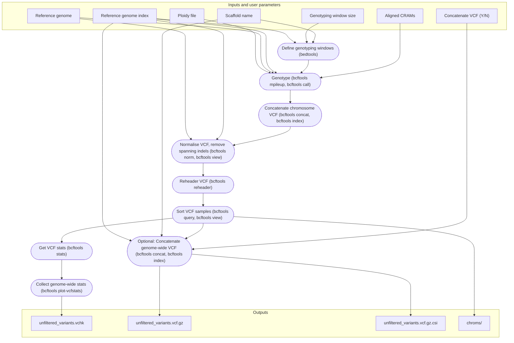
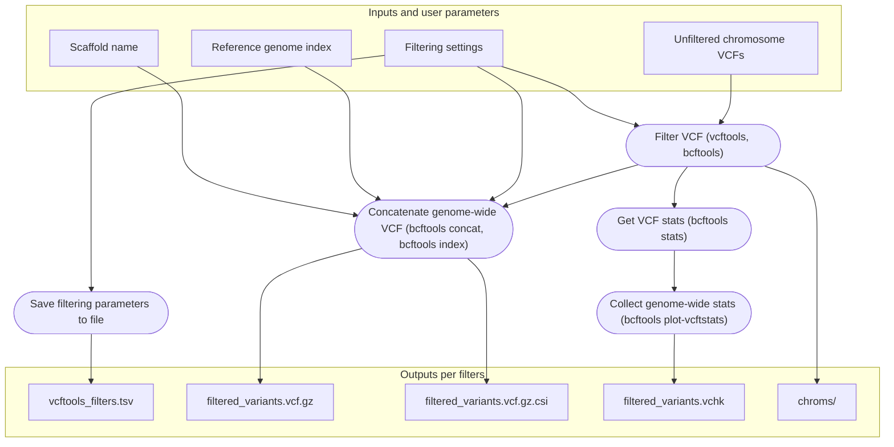

# XENO: Expedient Genotyping for Non-Model Organims

## What is XENO?
XENO is a beginner-friendly genotyping pipeline built for evolutionary and ecological genomics. With XENO, you can (1) trim reads and align them to a reference genome, (2) call variants, (3) filter those variants, and finally (4) phase the variants. These four stages of XENO may be performed separately in stepwise order or end-to-end. At each stage, XENO outputs alignments, variant call files, and / or quality control statistics. These outputs may be passed directly to workflows from XENO's companion repository [RIPLEY](https://github.com/EcoEvoGenomics/RIPLEY), which automate many of the most common analyses in evolutionary and ecological genomics.

The Wiki describes XENO in greater detail. There you will also find guides for some specific use-cases or users.

## Installation
### Prerequisites
*In short: Nextflow 25.04.6, Slurm, Apptainer, Internet access.*

XENO is intended to run on a high-performance computing (HPC) system and is built with [Nextflow](https://www.nextflow.io/) version 25.04.6. This *specific* version of Nextflow must be installed to use XENO. Out of the box, XENO also depends on the HPC job manager Slurm and the software container system Apptainer. Users familiar with Nextflow may alternatively reconfigure the nextflow.config file to use another job manager and another Docker-compatible container system, but regrettably we are unable to provide much support for such use cases. Once you have installed Nextflow on an HPC with Slurm and Apptainer, XENO automatically fetches the remaining software requirements. Note that XENO therefore must be run from an environment with internet access.

### Installing Nextflow with Conda
If you must install Nextflow version 25.04.6, you can e.g. do so with Conda: the environment we used to develop XENO is listed in the included YAML file.
```sh
conda create --name nf -f examples/nextflow-25.04.6.conda.yaml 
```

### Installing XENO
The intended way to "install" XENO is simply to clone this GitHub repository to a suitable location on your HPC environment:
```sh
git clone https://github.com/EcoEvoGenomics/genotyping_pipeline
```
Be mindful that XENO can and often will produce terabytes of working files. It is therefore ill-advised to install XENO to a location with limited storage space and especially to locations where you share limited storage space with others (unless you are certain what you are doing).

### Installing a development version of XENO
While XENO is not in active development for new features, we do strive to maintain it. For instance we try to respond to bug reports and improve robustness to different inputs as more users bring their unique data to XENO. As such, there will on occasion be branches that are more recent than `main`. If you wish to use an in-development version you can obtain a specific branch, e.g. `dev`:
```sh
git clone -b dev https://github.com/EcoEvoGenomics/genotyping_pipeline
```

## Quickstart
### Summary

1. Ensure XENO has direct read-access to your (`fastq.gz`) sequencing files. If they are stored externally, you must usually download them.
2. Ensure XENO has direct read-access to your reference genome files and that the reference files are correctly formatted (see [here](#required-reference-files)).
3. Prepare an input file with sample information in comma-separated (`.csv`) format (see [here](#how-to-correctly-format-your-input-csv-file)).
4. Adjust options as necessary and finally launch XENO (see [here](#how-to-launch-xeno)).

### Required reference files
XENO requires three mandatory and one optional piece of reference information. They are:

- A reference genome in uncompressed fasta format (`.fa`, `.fasta`). This must have been separately indexed with `bwa index`, and the index output files (`.amb`, `.ann`, `.bwt`, `.fai`, `.pac`, and `.sa`) must be found at the same path. Contigs and scaffolds in the reference genome **must** be named with alphanumerical characters and underscores only. For reference genomes that do not conform to this requirement, simply rename the contigs in the reference index and in supporting metadata such as GFF files. We regret the inconvenience and may update XENO in the future to accomodate more contig names.
- A prefix (as a text string) to distinguish scaffolds from contigs. Many reference genomes distinguish loosely assembled scaffolds from full contigs (e.g. `chr1`, `chr2`, ...) by prefixing their names with different strings. For instance, NCBI reference genomes may prefix contigs with "NC_" and scaffolds with "NW_". If applicable, you should provide the prefix characteristic of scaffolds (e.g. `NW_`) to enable more efficient distribution of genotyping windows. If not applicable, you may provide an arbitrary string that matches no contig.
- A ploidy file (such as in the `examples/` directory). This file is required to call sex chromosomes, haploid chromosomes, mtDNA, or other non-diploid chromosomes correctly. By default every contig is considered diploid.
- **Optional:** For variant phasing, you *may* provide XENO the absolute path to a directory containing recombination rate maps. The recombination maps must be compatible with [SHAPEIT5](https://odelaneau.github.io/shapeit/). The directory should contain one recombination map file for each contig in the reference genome and they must be named on the format "contig.map". If for instance your reference genome has the contigs "chr1" and "chr2", the recombination map directory must contain two files: "chr1.map" and "chr2.map". If you do not have recombination maps, you may set this variable to an arbitrary path: XENO will statistically phase the variants instead of using maps.

### How to correctly format your input CSV file
For each sample you wish to genotype, XENO requires five inputs. You must provide the inputs in a comma-separated file (`.csv`) with one row per pair of forward and reverse read files and five columns:

1. Sample ID. A single text string of *only* alphanumeric characters, e.g. "SAMPLE1" but not "SAMPLE_1" or "SAMPLE.1".
2. Sample sex. The sex codes (e.g. F, M) are arbitrary but must correspond to the reference ploidy file (see [above](#required-reference-files)).
3. Lane code to distinguish reads from the same sample from different sequencing lanes. Use the format "LXXX" where "XXX" is a number with leading zeroes (e.g. L001). If you have only one set of files per sample, use only "L001". If you have more sets of file per sample, separate them on different rows with increasing lane codes. In *principle* the format (LXXX) is arbitrary, but the QC report will only be organised correctly when this format is adhered to.
4. Absolute path to the forward read file (R1).
5. Absolute path to the reverse read file (R2).

These inputs must be in the above order from left to right. For example:

| Sample ID | Sex | Lane | Path to R1 FASTQ.GZ file | Path to R2 FASTQ.GZ file |
|------------------|---|------|-------------------------|-------------------------|
| PDOM2024IND0001M | M | L001 | /path/to/1M_L001_R1.fastq.gz | /path/to/1M_L001_R2.fastq.gz |
| PDOM2024IND0001M | M | L002 | /path/to/1M_L002_R1.fastq.gz | /path/to/1M_L002_R2.fastq.gz |
| PDOM2024IND0002F | F | L001 | /path/to/2F_R1.fastq.gz | /path/to/2F_R2.fastq.gz |

**Do not include headers** and ensure that the file corresponds to regular CSV conventions: separate values only by commas, add no trailing or leading spaces, and include a newline at the end. You should prepare the CSV in a raw text editor to avoid unexpected formatting discrepancies from spreadsheet software such as Microsoft Excel or Numbers.

### How to launch XENO
#### Setting required launch options
Before launching XENO, you must edit two files: `nextflow.config` and `options.yaml`. In `nextflow.config`, you should configure Nextflow to interface correctly with the HPC system you use. For instance, you should configure Nextflow to use the correct job queue names for jobs which require access to GPUs or large amounts of memory:
```json
process {

  withLabel: "require_gpu" {
    clusterOptions = "--account=your_account --gpus=1"
    queue = "a100"
    cpus = 8
  }

  withLabel: "high_mem_per_cpu" {
    queue = "bigmem"
  }
  
}
```
Consult the documentation for the HPC you use to select an appropriate queue for each of these labels. This is *especially* salient for the `high_mem_per_cpu` label. The cost of jobs with a high memory allocation could increase drastically on a queue with limited memory - at no benefit to you (or other users of the same HPC). While to some extent we have optimised XENO's resource consumption, XENO does not (and cannot) estimate the monetary cost of a job: your use of paid (and indeed, shared) resources is your own responsibilty. After configuring Nextflow appropriately, you may optionally modify settings such as the maximum number of concurrent tasks. See the [Nextflow documentation](https://docs.seqera.io/nextflow/config) for options.

You must provide options other than the Nextflow configuration settings in `options.yaml`. These options are:
```yaml
# Absolute path to input CSV
samples: 

# Which steps to run?
trim_align: true
call_variants: true
filter_variants: true
phase_variants: true

# Options for read pre-processing and alignment
deduplicate: false
downsample: false
read_target: 1000000
aligner: gpu
exclude_flags: 0x400

# Options for variant calling
concatenate_raw_vcf: false

# Options for variant filtering
filtering_label: default_filters
filtering_flags: ./examples/default_filters.txt

# Options for phasing
phasing_window_size: 10000000

# Reference genome
ref_genome: 
ref_recombination_map_dir: 
ref_scaffold_name: 
ref_ploidy_file: ./examples/default.ploidy
```
First provide an absolute path to your sample CSV to `samples`. Then indicate which steps to run by setting `trim_align`, `call_variants`, `filter_variants`, and `phase_variants` to `true` or `false`. You may repeat steps (usally variant filtering) with different settings by setting the previous steps to `false` and relaunching.

For the read trimming and alignment step, indicate whether to `deduplicate` read files with `true` or `false`, and whether to `downsample` read files to the number of reads specified by `read_target`. Next, pick an alignment method by setting `aligner` to one of `gpu` ([Nvidia Parabricks fq2bam](https://docs.nvidia.com/clara/parabricks/tool-reference/tools/fq2bam)), `mem` (bwa mem), or `aln` (bwa aln). The most efficient is `gpu`, but note that you must have access to [compatible GPUs](https://docs.nvidia.com/clara/parabricks/get-started/installation-requirements#hardware-requirements) to use that option. After alignment, exclude reads with alignment flags specified by `exclude_flags` from alignment maps. The default setting (0x400) filters out PCR and optical duplicates.

The variant calling step has only one option: whether to `concatenate_raw_vcf` (`true` or `false`). By default (`false`), XENO outputs raw, unfiltered variant calls in one VCF file per chromosome. If `concatenate_raw_vcf: true`, XENO will also output a whole-genome VCF of the raw variant calls. Note that such a file can occupy hundreds of gigabytes or even terabytes. For variant filtering, provide the path to a file with VCFtools filtering flags to `filtering_flags` and name these filters by setting `filtering_label`. Here, you may refer to the default filters and the [VCFtools documentation](https://vcftools.github.io/man_latest.html#SITE%20FILTERING%20OPTIONS). If you have enabled phasing, you may adjust the degree of parallelisation by changing `phasing_window_size`.

Finally, provide the [required reference files](#required-reference-files). For paths, use absolute paths.

#### Launching XENO through the job scheduler
Experienced UNIX / HPC users will require no assistance launching XENO: simply load the required dependencies and call `bash ./XENO` in the way you see fit. This section and the next will cover two such ways for less experienced bioinformaticians.

A simple way to run XENO is to write a Slurm job script to load dependencies and launch XENO. For example, see `./examples/quickstart.sh`:
```sh
#!/bin/bash

# ADMIN
#SBATCH --job-name=XENO
#SBATCH --output=SLURM-%j-%x.out
#SBATCH --error=SLURM-%j-%x.err
#SBATCH --account=nn10082k

# RESOURCE ALLOCATION
#SBATCH --nodes=1
#SBATCH --tasks=1
#SBATCH --ntasks-per-node=1
#SBATCH --cpus-per-task=1
#SBATCH --mem-per-cpu=5G
#SBATCH --time=99:00:00

# This quickstart script works on the NRIS Saga HPC for users with access
# to the nn10082k project number. Must be run from top-level in the repo.

module --quiet purge
module load Miniconda3/22.11.1-1
source ${EBROOTMINICONDA3}/bin/activate
conda activate /cluster/projects/nn10082k/conda_group/Nextflow25.04.6
bash ./XENO
```
Note that the `quickstart.sh` script was written for the NRIS Saga HPC. It is a working example, but not universally applicable. You should consult your HPC documentation to modify this script to the specifications of your HPC environment. When you have prepared your Slurm script, simply delegate it to a compute node with:
```sh
sbatch your_launch_script.sh
```
You may then monitor XENO's progress by perusing the slurm logs, and by inspecting the Slurm queue with `squeue --me`. Note that launching XENO through `sbatch` means launching Nextflow on a compute node: this may lead to unexpected problems. If you experience errors while launching XENO through the job scheduler, read on below.

#### Launching XENO on a screen terminal
The most robust way to launch XENO is directly from the terminal. However, XENO should not usually be launched from a regular terminal window, because processes in a regular terminal window are interrupted when you exit. Instead you can open a screen terminal, which persists indefinitely in the background. If you are unfamiliar, the following is a brief introduction. You open a screen terminal with:
```sh
screen
```
You may exit the screen terminal by simultaneously holding the keys Ctrl + A, then the key D on your keyboard. Then, to resume the screen session, use:
```sh
screen -r
```
If you have multiple screen sessions running, you can use the following command to list the active screen terminals:
```sh
screen -list
```
Then you may use the following to resume a specific screen session:
```sh
screen -r session-id-here
```
You must load the necessary prerequesite software on the screen terminal before launching XENO. Like [above](#launching-xeno-through-the-job-scheduler), the exact steps required will depend on your HPC, but this should look something like the following. Please note that these commands will not (necessarily) work - they are for illustration. Consult your HPC documentation to get information about available modules and how to activate Conda.
```sh
module load conda
conda activate Nextflow-25.04.6
bash ./XENO
```
Alternatively, you may [prepare a script with the necessary commands](#launching-xeno-through-the-job-scheduler) and run it directly from the screen terminal (you may omit Slurm headers as they are ignored here):
```sh
bash your_launch_script.sh
```
Either way, on the screen terminal you can monitor Nextflow in real-time as it launches compute jobs. The individual compute jobs are visible through `squeue --me` as usual. The queue is accessible from any terminal. No heavy computation is performed on the screen terminal, which primarily handles software downloads and monitors the compute jobs.

#### Resuming XENO
It is not entirely unusual for HPC jobs to stop prematurely - perhaps because your compute allocation was depleted, because you accidentally cancelled a job, or for altogether enigmatic and irreproducible reasons. Thankfully, Nextflow caches progress (in a subdirectory called `/work`) so that XENO can resume in the event of an untimely stop. Simply ensure all XENO jobs were cancelled, then relaunch. Of course, XENO most often stops in the event of (user) error. XENO is most prone to errors caused by faulty read files for individual samples. If this befalls you, you may simply remove the offending sample from the input CSV and relaunch XENO. We are unable to troubleshoot read files for you, but if XENO persistently exits with an error for another reason, feel free to post a GitHub Issue. Please describe the error in sufficient detail to reproduce it.

## How to cite XENO
Thank you for using XENO. If you wish to cite XENO, you should first cite the third-party software XENO uses. Below is an exhaustive list: please take care to cite appropriately to your own use-case.

### Citing third-party software
- Read deduplication and downsampling: [SeqKit v. 2.10.0](https://doi.org/10.1002/imt2.191)
- Read trimming: [fastp v. 0.24.0](https://doi.org/10.1002/imt2.70078); [FastQC v. 0.12.1](https://www.bioinformatics.babraham.ac.uk/projects/fastqc/)
- Alignment ("gpu" option): [Parabricks v. 4.5.0-1](https://doi.org/10.1101/2025.07.23.666378); [SAMtools v. 1.17](https://doi.org/10.1093/gigascience/giab008)
- Alignment ("[mem](https://doi.org/10.48550/arXiv.1303.3997)" and "[aln](https://pubmed.ncbi.nlm.nih.gov/19451168/)" option): [bwa v. 0.7.17](https://doi.org/10.48550/arXiv.1303.3997); [SAMtools v. 1.17](https://doi.org/10.1093/gigascience/giab008); [GATK4 v. 4.6.2.0](https://www.oreilly.com/library/view/genomics-in-the/9781491975183/)
- Variant calling: [BEDtools 2.30.0](https://doi.org/10.1093/bioinformatics/btq033); [BCFtools 1.17](https://doi.org/10.1093/gigascience/giab008)
- Variant filtering: [VCFtools 0.1.16](https://doi.org/10.1093/bioinformatics/btr330); [BCFtools 1.17](https://doi.org/10.1093/gigascience/giab008)
- Variant phasing: [BEDtools 2.30.0](https://doi.org/10.1093/bioinformatics/btq033); [SHAPEIT5 v. 5.1.1](https://doi.org/10.1038/s41588-023-01415-w); [BCFtools 1.17](https://doi.org/10.1093/gigascience/giab008)
- Quality control report: [MultiQC v. 1.28](http://dx.doi.org/10.1093/bioinformatics/btw354)

### Citing XENO
We plan to provide a citeable persistent identifier for XENO later. For the time being, you are welcome to cite this GitHub repository.

______
> XENO v. 4.0.0 | August 2026 | Erik Sandertun Røed & Mark Ravinet | https://github.com/EcoEvoGenomics/XENO 

## The pipeline
### Step 1: Read trimming and alignment

This first workflow will take your raw reads and run them through `fastqc` for a quality assessment. It will then trim them for low-quality bases and remove any adapter sequences with `fastp`. If you enable the deduplication step, then this will be done using `seqkit`. Similarly if the downsampling option is enabled, then `seqkit` will perform this too. Once trimming, and optionally deduplication and downsampling is complete, the `fastqc` quality assessment will be repeated. Then, the pipeline will group reads (i.e. from across lanes) belonging to the same individuals and map them to a reference genome of your choice. This step is now performed by default with the `bwa mem` implemantation of [NVIDIA Clara Parabricks](https://docs.nvidia.com/clara/parabricks/latest/index.html) - a GPU accelerated genomics suite. This makes for extremely fast alignment (provided you have ample access to suitable GPUs). Alternatively, you may opt to align using the original CPU-based implementation of `bwa mem` or its predecessor `bwa aln`. While `bwa aln` could be more suitable for very short reads, be mindful that its output is not directly comparable to that of Parabricks' `bwa mem` implementation. Once aligned, the pipeline will produce statistics on the mapping efficiency and depth of coverage of each mapped individual before filtering out PCR and optical duplicates (by default) and then repeating the quality assessment.


```mermaid
flowchart TB
   subgraph "Inputs and user parameters"
   v0["Reads CSV"]
   v7["Downsample (Y/N)"]
   v4["Deduplicate (Y/N)"]
   v14["Reference genome and indices"]
   v18["Scaffold name"]
   v51["Aligner (gpu/mem/aln)"]
   end
   v2(["Get reads stats (fastqc)"])
   v5(["Optional: Deduplicate reads (seqkit rmdup)"])
   v8(["Optional: Downsample reads (seqkit sample)"])
   v10(["Trim reads (fastp)"])
   v12(["Group reads across lanes"])
   v50(["Select aligner"])
   v16(["Align reads (parabricks)"])
   v48(["Align reads (bwa-mem)"])
   v40(["Align reads (bwa-aln)"])
   v43(["Merge alignments from different lanes"])
   v45(["Sort merged alignment (picard)"])
   v47(["Mark duplicates in alignment (picard)"])
   v19(["Get alignment stats (samtools)"])
   v25(["Filter alignment (samtools)"])
   v0 --> v2
   v0 --> v5
   v5 --> v8
   v8 --> v10
   v10 --> v2
   v10 --> v12
   v10 --> v40
   v10 --> v48
   v12 --> v16
   v14 --> v16
   v14 --> v40
   v14 --> v48
   v16 --> v19
   v16 --> v25
   v18 --> v19
   v14 --> v19
   v25 --> v19
   v4 --> v5
   v7 --> v8
   v10 --> v20
   v2 --> v21
   v25 --> v22
   v25 --> v23
   v16 --> v24
   v19 --> v24
   v51 --> v50
   v50 --> v12
   v50 --> v48
   v50 --> v40
   v48 --> v43
   v40 --> v43
   v43 --> v45
   v45 --> v47
   v47 --> v19
   v47 --> v25
   subgraph "Outputs"
   v20["Trimmed reads (R1/R2 per lane)"]
   v21["Read QC metrics (R1/R2 per lane)"]
   v22["SAMPLE_ID.cram"]
   v23["SAMPLE_ID.cram.crai"]
   v24["Alignment QC metrics"]
   end
```

This part of the pipeline produces the following outputs:

- trimmed reads (per lane, not per sample)
- Read QC metrics (per lane, not per sample)
- Aligned cram file (`SAMPLE_ID.cram`)
- Aligned cram file index (`SAMPLE_ID.cram.cai`)
- Alignment QC statistics

### Step 2: Variant calling

The second workflow in the pipeline will take aligned crams and perform variant calling (genotyping) on all individuals against the specified reference genome. To do this, it uses `bcftools` to call sites at every position in the genome (i.e. it calls invariant sites as well as variants). This is obviously a large job, especially on larger genomes. So to increase efficiency, the script parallelises across genome windows. These windows are defined internally based on the number of input samples, to parallelise the genotyping most cost-efficiently. The pipeline also takes into account ploidy of the sex chromosomes and the mitochondrial genome (**Note:** this is, in fact, currently broken and you should use output for *autosomes only* - but a fix is planned). After calling genotypes in windows, the script will take care of sorting and concatenating the windows together so that you are left with a vcf file for each chromosome, the mtDNA and also the unanchored scaffolds in your genome. These are unfiltered and ready for the next step. It also generates some statistics for downstream checking.

Optionally, you can enable concatenation of the chromosomal VCFs into one whole-genome VCF. If so, the pipeline will automatically consult the reference genome index in order to concatenate the chromosomes in the correct order. All (non-chromosome) scaffolds are always placed at the end. **Note:** Other than for QC, you are unlikely to need an unfiltered whole-genome VCF, and it will potentially be very, *very* large. The same concatenation process is always run in the next step of the pipeline (variant filtering) so you will get a whole-genome concatenated *filtered* VCF.


```mermaid
flowchart TB
   subgraph "Inputs and user parameters"
   v6["Genotyping window size"]
   v22["Concatenate VCF (Y/N)"]
   v2["Reference genome"]
   v11["Aligned CRAMs"]
   v4["Reference genome index"]
   v7["Scaffold name"]
   v0["Ploidy file"]
   end
   v8(["Define genotyping windows (bedtools)"])
   v13(["Genotype (bcftools mpileup, bcftools call)"])
   v14(["Concatenate chromosome VCF (bcftools concat, bcftools index)"])
   v16(["Normalise VCF, remove spanning indels (bcftools norm, bcftools view)"])
   v17(["Reheader VCF (bcftools reheader)"])
   v18(["Sort VCF samples (bcftools query, bcftools view)"])
   v19(["Get VCF stats (bcftools stats)"])
   v21(["Collect genome-wide stats (bcftools plot-vcfstats)"])
   v23(["Optional: Concatenate genome-wide VCF (bcftools concat, bcftools index)"])
   v4 --> v8
   v4 --> v23
   v6 --> v8
   v7 --> v8
   v7 --> v23
   v0 --> v13
   v2 --> v13
   v4 --> v13
   v8 --> v13
   v11 --> v13
   v13 --> v14
   v2 --> v16
   v4 --> v16
   v14 --> v16
   v16 --> v17
   v17 --> v18
   v18 --> v19
   v19 --> v21
   v18 --> v23
   v22 --> v23
   v21 --> v26
   v23 --> v24
   v23 --> v25
   v18 --> v27
   subgraph "Outputs"
   v24["unfiltered_variants.vcf.gz"]
   v25["unfiltered_variants.vcf.gz.csi"]
   v26["unfiltered_variants.vchk"]
   v27["chroms/"]
   end
```

This part of the pipeline produces the following outputs:

- Statistics on unfiltered variants
- Per-chromosome unfiltered variant VCF plus unfiltered variant VCF for scaffolds
- Concatenated unfiltered variant VCF (optional)
- CSI index for any vcf produced. 

### Step 3: Variant filtering

The third workflow filters your VCF files to prepare them for downstream analysis. You need to provide the filtering flags you require in a text file via the main slurm script. See `examples/default_filters.txt` for formatting - the required format is a file with `vcftools` flags, so you have complete freedom to specify any combination of filtering flags accepted by `vcftools` (see the `vcftools` [documentation](https://vcftools.github.io/man_latest.html#SITE%20FILTERING%20OPTIONS)). The filters you specify will be applied to the unfiltered chromosome level VCFs. The filtered per-chromosome VCFs are then concatenated and normalised to yield filtered VCFs both per-chromosome and whole-genome. The pipeline automatically concatenates the per chromosome VCFs in the order specificed by the reference genome index and places all scaffolds at the end. The workflow finally outputs statistics on the filtered variants which can be incorporated in the multiQC reports in the next and final step. 

It is worth noting that filtering is not a black-box/set-and-forget/run-once process! The filters you apply matter, and not only should you think carefully about them, you may very well need to produce datasets with different filters for different downstream analyses (see https://doi.org/10.1038/s41576-024-00738-6). For that reason, the pipeline has been built to make it easy to return to this step after you've produced the MultiQC report and inspected the quality statistics (below). To take an example, you may first run the pipeline through all steps, i.e. `yes` for all `trim_align_reads`, `call_variants`, `filter_variants` (and `phase_variants`) with default filters. Then you can switch off `trim_align_reads` and `call_variants` but re-run `filter_variants` (and, again, `phase_variants`) with different filtering settings (recall that all the settings you can change are exposed in the main SLURM script and you should not change anything elsewhere) in the same directory to produce a re-filtered dataset (**without changing anything else**). To do so, simply change the `filtering_label` variable (to give a new name to your refiltered data) and the relevant filtering settings. Your newly re-filtered dataset will be found in a correspondingly labelled directory under the filtered genotypes directory and the MultiQC report will be updated to show (all) the re-filtered dataset alongside the unfiltered data. You can do this as many times as you need until you are content your filters are appropriate!


```mermaid
flowchart TB
   subgraph "Inputs and user parameters"
   v5["Filtering settings"]
   v0["Unfiltered chromosome VCFs"]
   v4["Reference genome index"]
   v14["Scaffold name"]
   end
   v1(["Filter VCF (vcftools, bcftools)"])
   v3(["Get VCF stats (bcftools stats)"])
   v6(["Collect genome-wide stats (bcftools plot-vcftstats)"])
   v7(["Concatenate genome-wide VCF (bcftools concat, bcftools index)"])
   v8(["Save filtering parameters to file"])
   v0 --> v1
   v1 --> v3
   v3 --> v6
   v1 --> v7
   v5 --> v7
   v5 --> v8
   v5 --> v1
   v8 --> v9
   v4 --> v7
   v14 --> v7
   v7 --> v10
   v7 --> v11
   v6 --> v12
   v1 --> v13
   subgraph "Outputs per filters"
   v9["vcftools_filters.tsv"]
   v10["filtered_variants.vcf.gz"]
   v11["filtered_variants.vcf.gz.csi"]
   v12["filtered_variants.vchk"]
   v13["chroms/"]
   end
```

This part of the pipeline produces the following outputs:

- Statistics on filtered variants
- Per-chromosome filtered variant VCF plus one for scaffolds
- Concatenated filtered variant vcf (optional)
- CSI index for any vcf produced
- a tsv file summarising the filters applied 

### Step 4: Variant phasing

This final workflow allows you to phase the variants after filtering them, and will produce its output alongside your filtering output so that phased variants are always kept with the exact VCFs they were produced from.
This step uses the software [SHAPEIT5](https://odelaneau.github.io/shapeit5/) - you can read its expansive documentation to learn more about how it works. Here, though, it is used with default settings apart from the optional
use of a user-specified recombination map. **Note that if the recombination map directory does not contain recombination maps for your contigs (chromosomes), the pipeline will run SHAPEIT5 with the default recombination rate setting of 1cM/Mb across the genome.**


```mermaid
flowchart TB
    subgraph "Input and user parameters"
    v1["Window size"]
    v9["Recombination maps"]
    v0["Reference genome index"]
    v7["Unphased index"]
    v5["Unphased VCF"]
    v2["Scaffold name"]
    end
    v3(["Define windows"])
    v10(["Phase variants in windows (SHAPEIT5)"])
    v11(["Ligate phased windows (SHAPEIT5)"])
    v12(["Convert BCF to VCF (bcftools)"])
    v0 --> v3
    v1 --> v3
    v2 --> v3
    v2 --> v10
    v3 --> v10
    v5 --> v10
    v7 --> v10
    v9 --> v10
    v10 --> v11
    v11 --> v12
    v11 --> v13
    v12 --> v14
    v11 --> v15
    v12 --> v15
   subgraph "Outputs"
   v13(["Phased BCFs (per chromosome)"])
   v14(["Phased VCFs (per chromosome)"])
   v15(["BCF / VCF indices (per chromosome)"])
   end
```

This part of the pipeline produces the following outputs:

- Per-chromosome phased BCF
- Per-chromosome phased VCF
- CSI index for each BCF and VCF produced

## The quality control report

The pipeline always produces a quality control report, whether you run a single step (or even none!) of the pipeline or when it is run in entirety. The report gives you an overview of the quality of reads, samples, mapping performance and variant calling. It uses [multiqc](https://docs.seqera.io/multiqc) which comprehensively collates qc output to provide a powerful overview. This takes time to learn how to read but is well worth paying extra attention to in order to ensure your analyis has worked!

_A walkthrough of the MultiQC report will follow here later ..._
