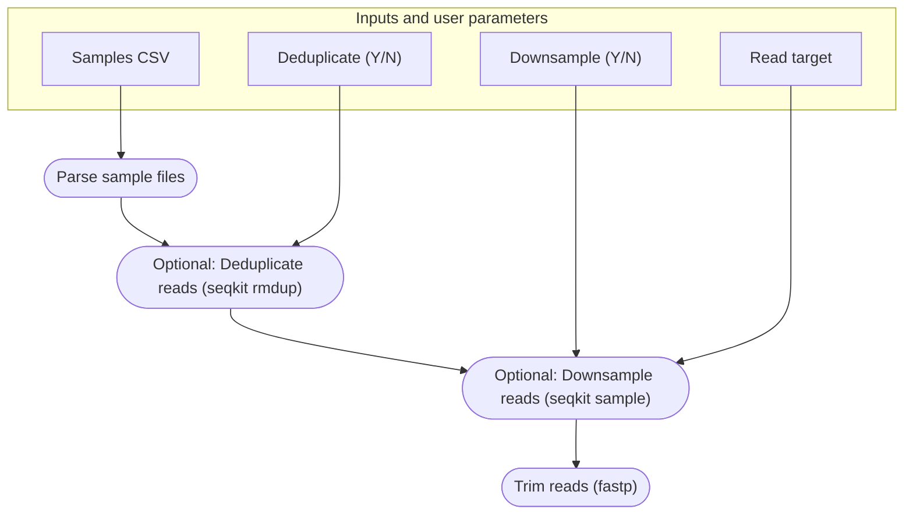
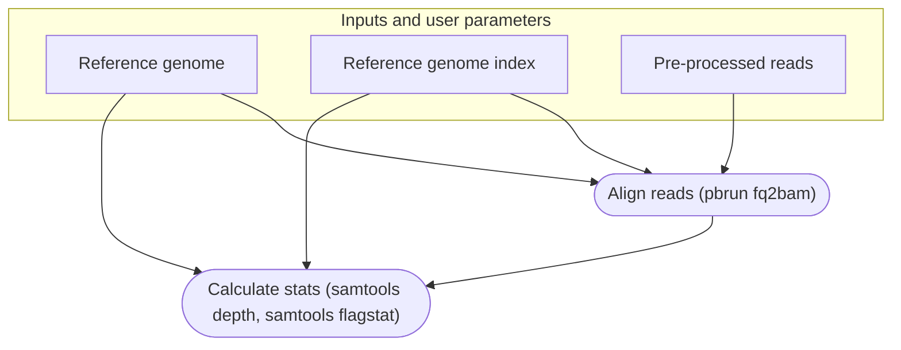
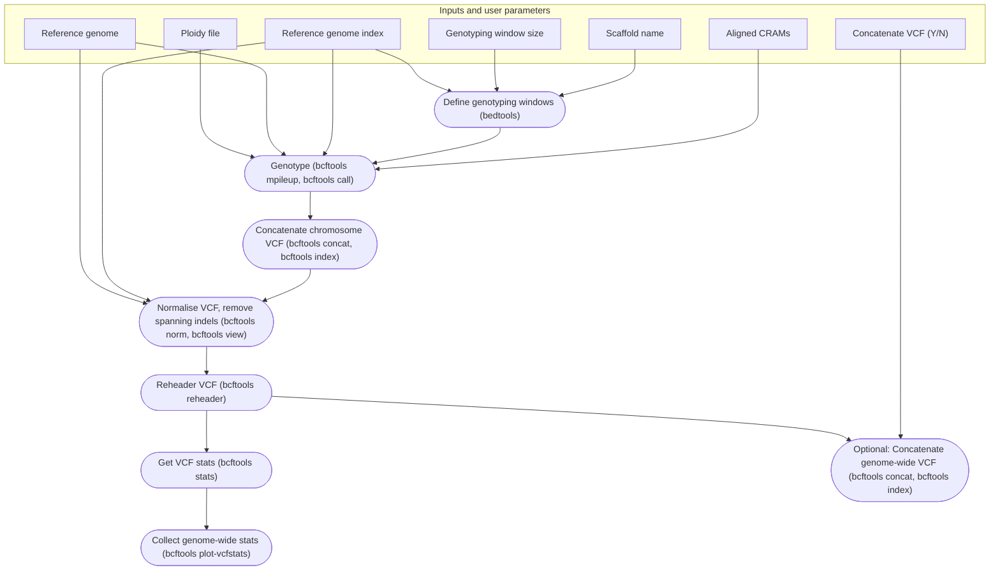
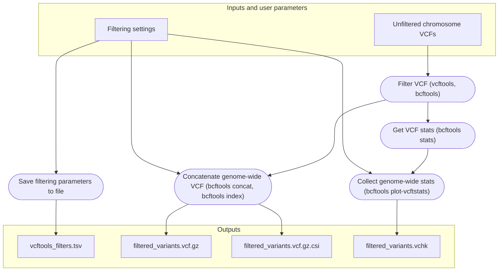
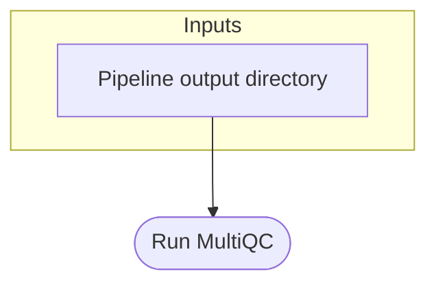

# Sparrow genotyping pipeline

**Authors:** Mark Ravinet and Erik Sandertun Røed

**Maintainer:** Erik Sandertun Røed

## Introduction
Welcome to the guide for the Ecological & Evolutionary Genomics Group sparrow genotyping pipeline. With this pipeline, you will only have to submit a single script to convert raw reads into a filtered `.vcf` file ready for your analyses. More than merely *simplifying* the process, the pipeline *standardises* genotyping within the group so that different projects produce and use compatible datasets. Just as important, the construction of the pipeline emphasises *reproducibility* to promote open science. Readers of our papers should be able to reproduce our results with minimal effort.

### The pipeline 
There are five primary steps in the pipeline, and you can specify whether to run all in one go or do them stepwise. In order, they are ...

1. `preprocess_reads`: Trims and optionally deduplicates and / or downsamples reads.
2. `align_reads`: Aligns the preprocessed reads to a reference genome. Outputs compressed alignment files.
3. `call_variants`: Calls SNP variants across and calculates statistics across the whole genome.
4. `filter_variants`: Applies filters to the SNP variants from the previous step and calculates statistics.
5. `multiqc`: Produces a report with interactive plots showing quality control statistics for outputs produced by the pipeline.

More details on each step are provided below.

## Installation and quick-start
This pipeline is developed primarily for in-house use on the NRIS Saga HPC, but should run on other compute resources and for other projects with minor modifications to its configuration files.

### Prerequesites
The pipeline requires a Linux HPC environment configured with the job management software SLURM, the container software Singularity (or Apptainer) and the environment management software Conda. If you are working on the NRIS Saga HPC, these softwares are pre-installed and the pipeline pre-configured to use them without manual intervention.

### Obtaining the pipeline
The easiest (and the intended) way to obtain and run the pipeline is to clone this GitHub repository to a suitable HPC location (on the NIRS Saga HPC, this is *exclusively* your `$USERWORK` directory, as the pipeline can produce terabytes of working files):
```
git clone https://github.com/EcoEvoGenomics/genotyping_pipeline
```
On occasion we upgrade or modify the pipeline. As a rule this will happen on a separate branch to maintain consistency on the main branch. If you wish to use an in-development version of the pipeline you can obtain a specific branch, e.g. `experimental`:
```
git clone -b experimental https://github.com/EcoEvoGenomics/genotyping_pipeline
```

### Configuring a Nextflow Conda environment
To maximise portability, especially for external users, most of the pipeline dependencies are managed automatically with containers obtained on-demand. But the software Nextflow manages this automation, so Nextflow itself must be manually installed in a Conda environment. Members of the Ecological and Evolutionary Genomics Group can and should use our pre-configured environment, which the pipeline is set to use by default. Other users can replicate our environment with the `nextflow.yml` file:
```
conda create --name nf -f nextflow.yml 
```

### Running the pipeline
In brief the three steps required to run the pipeline once you have cloned the repository are:

1. Download your reads to a location where the pipeline can reach them. If you have e.g. stored your reads on the NRIS NIRD storage infrastructure, you should copy them to your `$USERWORK` on the NRIS Saga HPC.
2. Prepare a comma-separated `.csv` file with sample information. See below.
3. Submit the `genotyping_pipeline.slurm.sh` script, completing and modifying `SETTINGS (1 / 2) User input` as required. Users of other HPC resources than the NRIS Saga HPC will likely have to modify the `SETTINGS (2 / 2) Set up environment` section to ensure Slurm, Singularity, and Conda are set up appropriately. Apart from modifying the SLURM header you should not modify the script outside the `SETTINGS` blocks.

Additional details and examples are provided for each step below. If you are unfamiliar with the pipeline, please do read on!

### The samples csv format

The input `.csv` file should be formatted with one sample per row and the following columns:

1. Sample name, e.g. `PDOM2024IND0001M` for a sparrow from our groups collection
2. Forward read location - this should be the **full path** to the forward read
3. Reverse read location - this should be the **full path** to the reverse read

As an example, your file should look like this but **without headers**:

| Sample ID | Path to R1 FASTQ.GZ file | Path to R2 FASTQ.GZ file |
|------------------|-------------------------|-------------------------|
| PDOM2024IND0001M | /path/to/1_R1.fastq.gz | /path/to/1_R2.fastq.gz |
| PDOM2024IND0002F | /path/to/2_R1.fastq.gz | /path/to/2_R2.fastq.gz |
| ... | ... | ... |

**Note:** If an individual is sequenced across multiple lanes, you will have multiple sets of files for the individual. The previous version of the pipeline was built to account for this, **however** this version currently does not accommodate it because of the choice of aligner software. *This will be remedied somehow in a future update*.

## The pipeline in detail
### Step 1: Read pre-processing


### Step 2: Read alignment


### Step 3: Genotyping (variant calling)


### Step 4: Variant filtering


### Step 5: Make a quality control report


-----------------
*This pipeline was initiated from a copy of https://github.com/markravinet/genotyping_pipeline_v2.git on Wednesday 11 Dec 2024.*